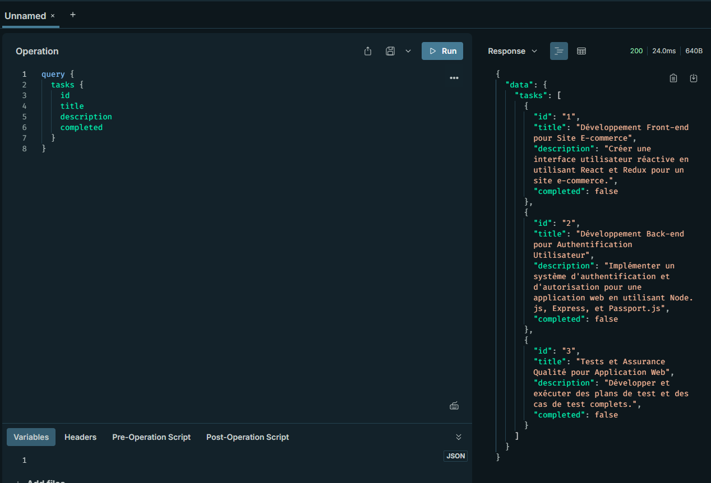
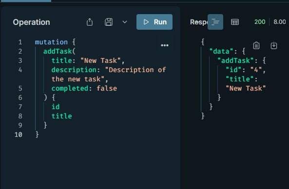
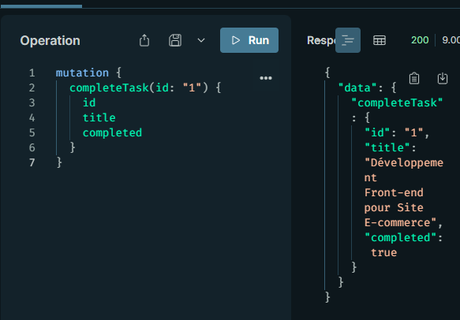
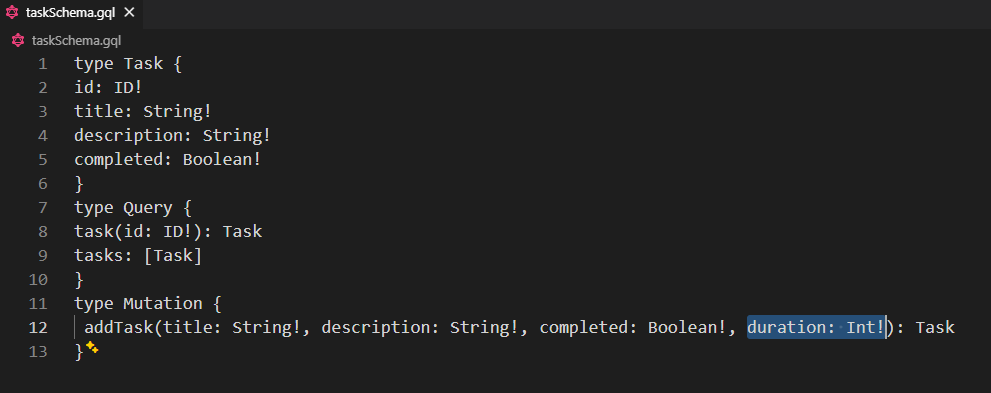
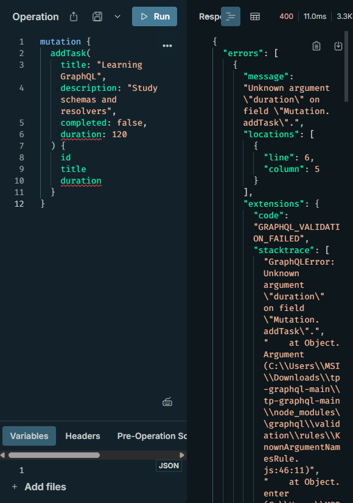
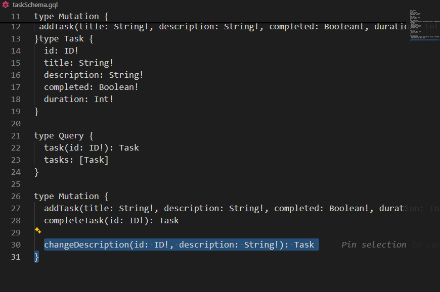
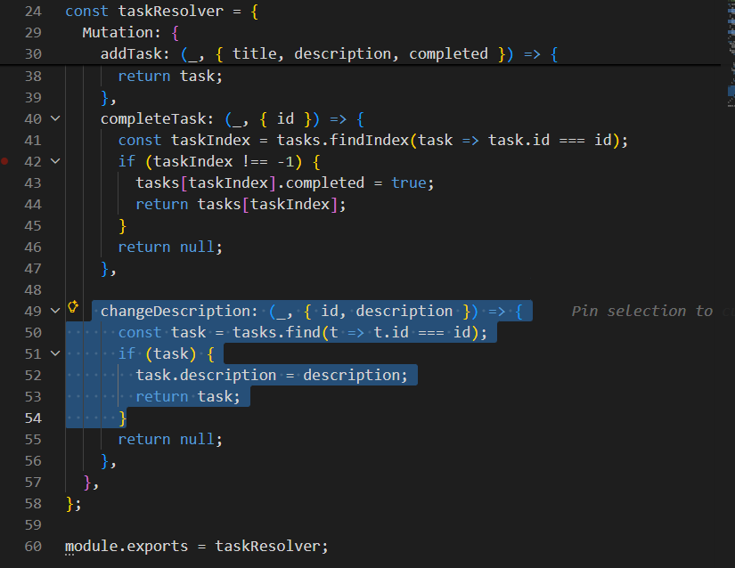
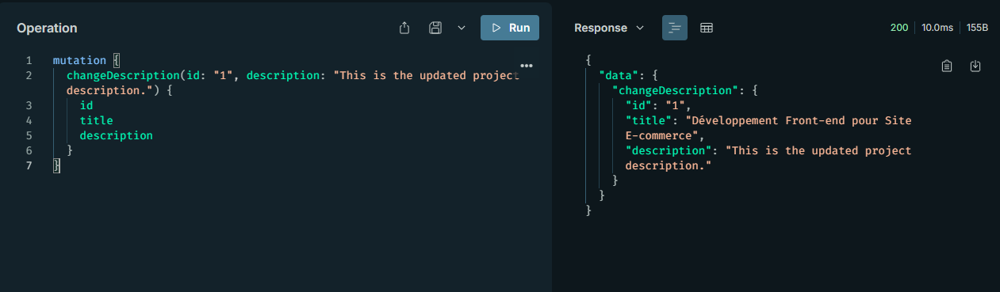
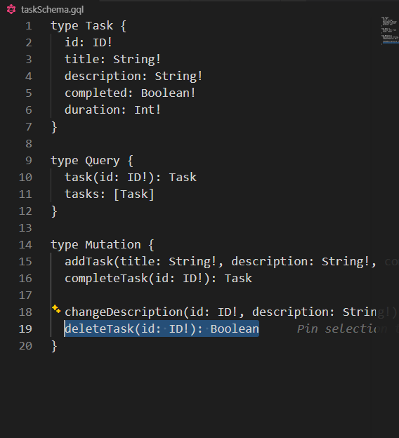
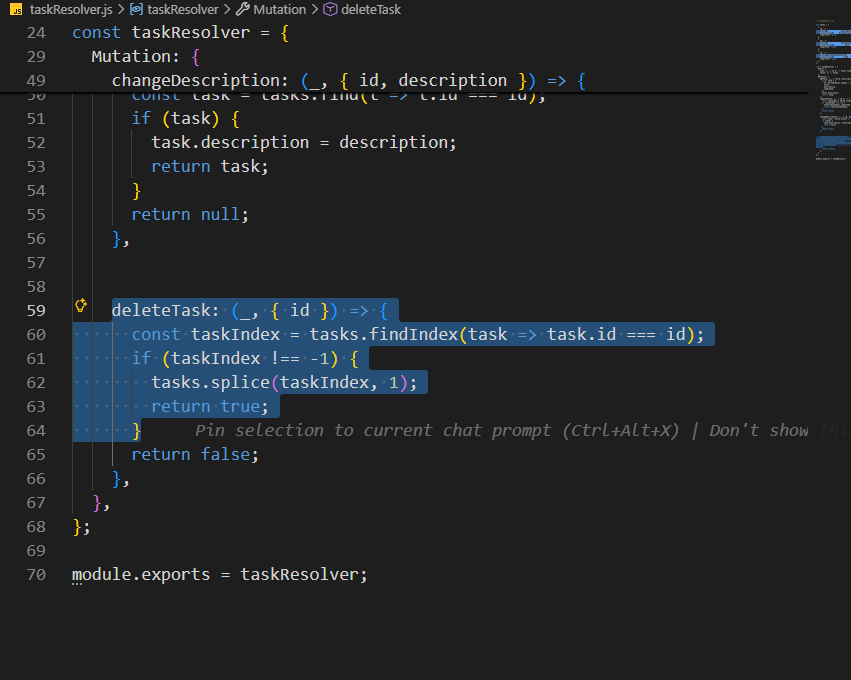

# tp-graphql

1* Créer des requêtes GraphQL pour
1: Récupérer toutes les tâches

2: Ajouter une nouvelle tâche

3: Marquer une tâche comme terminée

2* Ajouter au schéma de données une variable duration de type entier et apporter les
changements nécessaires.

3* Ajouter une mutation changeDescription pour changer la description de la tâche au
schéma et au résolveur.

4* Ajouter également une mutation deleteTask pour effacer une tâche par son id.

